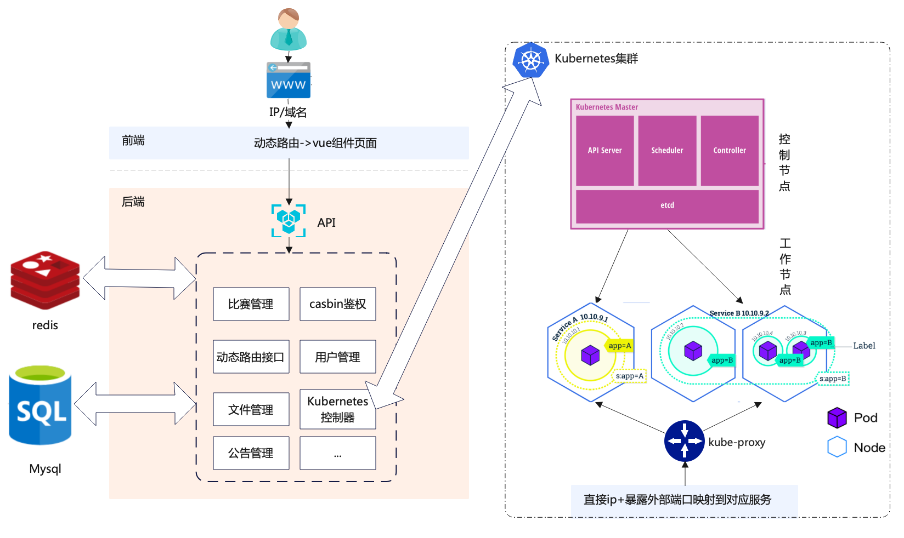
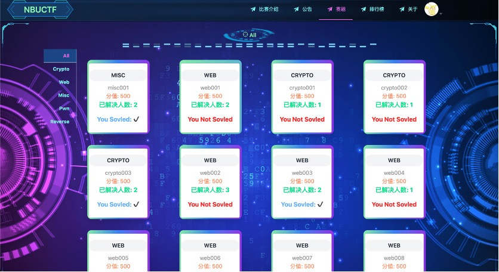
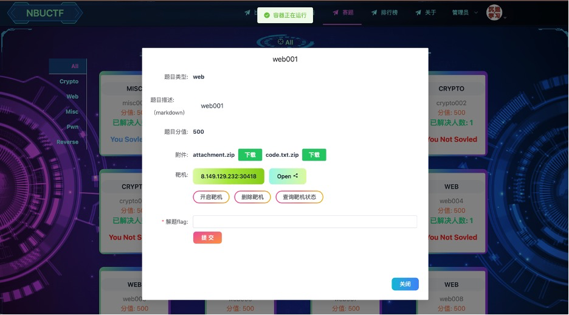
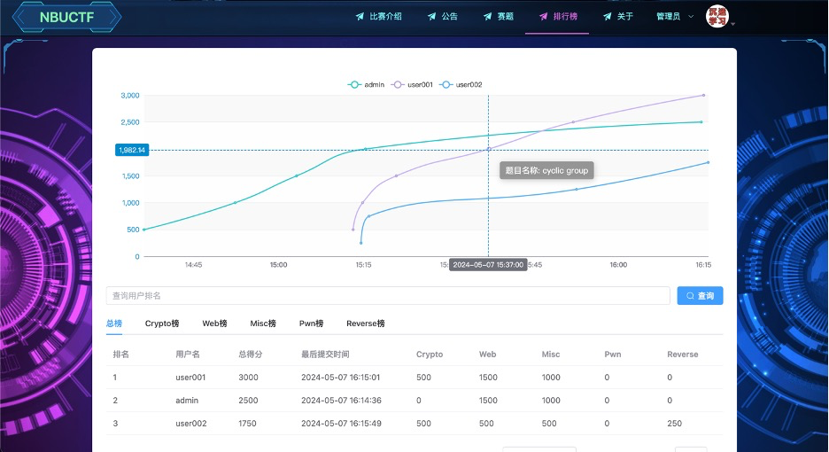
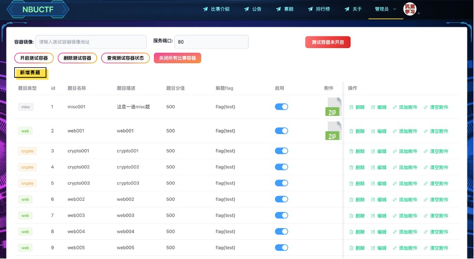

<div align=center>

</div>
<div align=center>
  
  
  
  
  
</div>

## 1. 基本介绍

NBUCTF_go 是一个基于 go 的开源 CTF 平台。
前端使用VUE3+element-Plus+Datav+tailwindcss等
后端使用golang+gin+gorm+casbin等
靶机使用docker，通过k3s实现管理。

部署采用docker-compse。

## 2. 使用说明

### 2.1 **快速部署**：

**[!建议]**使用docker-compose镜像**快速部署**：

**前提**：[搭建靶机需要的**k3s环境**](./k3s搭建指南),在server目录下放入k3s配置文件并重命名为k8sconfig.yaml

```bash
# 克隆项目
git clone https://github.com/lindocedskes/nbuctf_go.git
# 进入deploy文件夹
cd deploy
# 启动你的应用和它的依赖
docker-compose up
```

说明：
docker-compose.yaml 中拉取的镜像版本    image: lin088/nbuctf:v1.0  （为本地运行测试版，线上部署需要修改配置，重新build）
settings.yaml 为系统的各种配置，包含了数据库的默认密码，管理员默认登录账号密码为admin 123456

### 2.2 server项目启动：

后端启动前提：

server/settings.yaml 中配置mysql和redis
[搭建靶机需要的**k3s环境**](./k3s搭建指南),在server目录下放入k3s配置文件并重命名为k8sconfig.yaml

```bash
# 克隆项目
git clone https://github.com/lindocedskes/nbuctf_go.git
# 进入server文件夹
cd server

# 使用 go mod 并安装go依赖包
go generate

# 编译 
go build -o server main.go 

# 运行二进制
./server
```

### 2.3 前端项目nbuctfVue3启动

```bash
# 进入nbuctfVue3文件夹
cd nbuctfVue3
# Project Setup
pnpm install
# Compile and Hot-Reload for Development
pnpm dev
# 打包
pnpm build
```

#### Lint with [ESLint](https://eslint.org/) 规范纠错

```sh
pnpm lint
```
#### Format use [Prettier](https://eslint.org/) 代码格式化

```sh
pnpm format
```

## 3.平台系统总体架构设计



## 4.Demo 🗿


### 赛题页面：

### 答题卡片：下载附件，靶机开启...

### 排行榜：

### 赛题管理：


## 联系方式 ：
gmail：rolin.ytao@gmail.com

## 说明：

此项目开源，功能较为完善，且不用于商业用途，纯个人学习练手项目
后端框架学习了 [gin-vue-admin](https://github.com/flipped-aurora/gin-vue-admin) 开源项目

