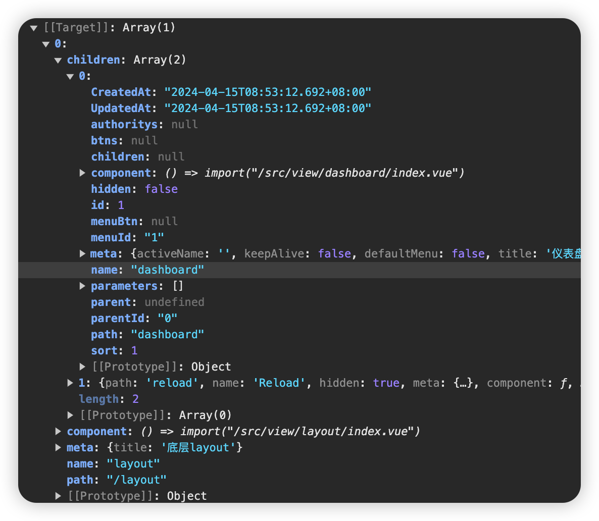
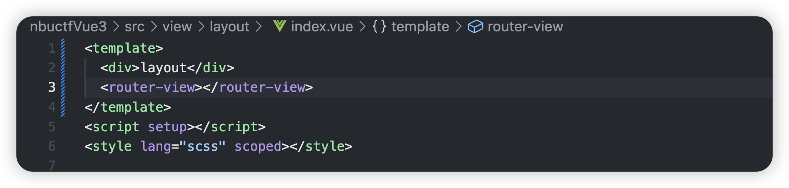
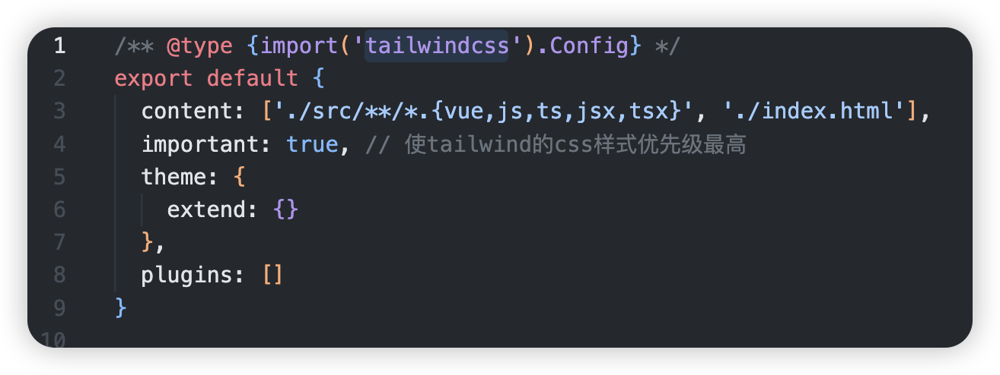

## Readme

首页整体路由设计

**路由规则**

| path              | 文件                             | 功能      | 组件名          | 路由级别 |
| ----------------- | -------------------------------- | --------- | --------------- | -------- |
| /login            | views/login/LoginPage.vue        | 登录&注册 | LoginPage       | 一级路由 |
| /layout           | views/layout/LayoutContainer.vue | 布局架子  | LayoutContainer | 一级路由 |
| ├─ /user/profile  | views/user/UserProfile.vue       | 个人详情  | UserProfile     | 二级路由 |
| ├─ /user/avatar   | views/user/UserAvatar.vue        | 更换头像  | UserAvatar      | 二级路由 |
| ├─ /user/password | views/user/UserPassword.vue      | 重置密码  | UserPassword    | 二级路由 |
| ├─ /user/profile  | views/user/UserProfile.vue       | 个人详情  | UserProfile     | 二级路由 |
| ├─ /user/avatar   | views/user/UserAvatar.vue        | 更换头像  | UserAvatar      | 二级路由 |
| ├─ /user/password | views/user/UserPassword.vue      | 重置密码  | UserPassword    | 二级路由 |


用户+权限处理

用户表 users

| id   | username | nick_name | authority_id |
| ---- | -------- | --------- | ------------ |
| 1    | admin    | 管理员    | 888          |
| 2    | user001  | 用户-队长 | 777          |
| 3    | user002  | 用户-队员 | 7771         |

角色表

| authority_id | authority_name | parent_id | default_router |
| ------------ | -------------- | --------- | -------------- |
| 888          | 管理员         | 0         | dashboard      |
| 777          | 队长           | 0         | dashboard      |
| 7771         | 队员           | 777       | dashboard      |

用户角色关联表 sys_user_authority 

| user_id | authority_id |
| ------- | ------------ |
| 1       | 888          |
| 2       | 777          |
| 3       | 7771         |

基础路由 sys_base_menu

| id   | path      | 对应组件                 | parent_id | default_router |
| ---- | --------- | ------------------------ | --------- | -------------- |
| 1    | dashboard | view/dashboard/index.vue | 0         | dashboard      |
| 2    | about     | view/about/index.vue     | 0         | dashboard      |


角色-菜单关联表 sys_authority_menus

| sys_base_menu_id | authority_id |
| ---------------- | ------------ |
| 1                | 888          |
| 1                | 777          |
| 1                | 7771         |
| 2                | 888          |


动态路由：登录用户 ->获取角色->获取对应菜单 ->加载动态路由


/base/login

```json
"user": {
            "id": 1,
            "CreatedAt": "2024-01-28T20:51:00.53+08:00",
            "UpdatedAt": "2024-02-03T15:35:32.909+08:00",
            "uuid": "daa391a1-3111-4886-b160-d50e9cf6279f",
            "userName": "admin",
            "nickName": "管理员",
            "sideMode": "dark",
            "headerImg": "https://127.0.0.1:8889/testuser.jpg",
            "baseColor": "#fff",
            "activeColor": "#1890ff",
            "authorityId": 888,
            "authority": {
                "CreatedAt": "2024-01-28T20:51:00.4+08:00",
                "UpdatedAt": "2024-02-13T16:37:08.113+08:00",
                "DeletedAt": null,
                "authorityId": 888,
                "authorityName": "管理员",
                "parentId": 0,
                "dataAuthorityId": null,
                "children": null,
                "menus": null,
                "defaultRouter": "dashboard"
            },
            "authorities": [
                {
                    "CreatedAt": "2024-01-28T20:51:00.4+08:00",
                    "UpdatedAt": "2024-02-13T16:37:08.113+08:00",
                    "DeletedAt": null,
                    "authorityId": 888,
                    "authorityName": "管理员",
                    "parentId": 0,
                    "dataAuthorityId": null,
                    "children": null,
                    "menus": null,
                    "defaultRouter": "dashboard"
                }
            ],
            "phone": "1234567890",
            "email": "testuser@example.com",
            "enable": 1
        },

"user": {
            "id": 2,
            "CreatedAt": "2024-01-28T20:51:00.53+08:00",
            "UpdatedAt": "2024-02-03T19:43:42.894+08:00",
            "uuid": "aa8a46a7-eb42-4e66-9359-4a815bfa641d",
            "userName": "user001",
            "nickName": "用户-队长",
            "sideMode": "dark",
            "headerImg": "https://127.0.0.1:8889/testuser.jpg",
            "baseColor": "#fff",
            "activeColor": "#1890ff",
            "authorityId": 777,
            "authority": {
                "CreatedAt": "2024-01-28T20:51:00.4+08:00",
                "UpdatedAt": "2024-01-28T20:51:00.4+08:00",
                "DeletedAt": null,
                "authorityId": 777,
                "authorityName": "队长",
                "parentId": 0,
                "dataAuthorityId": null,
                "children": null,
                "menus": null,
                "defaultRouter": "dashboard"
            },
            "authorities": [
                {
                    "CreatedAt": "2024-01-28T20:51:00.4+08:00",
                    "UpdatedAt": "2024-01-28T20:51:00.4+08:00",
                    "DeletedAt": null,
                    "authorityId": 777,
                    "authorityName": "队长",
                    "parentId": 0,
                    "dataAuthorityId": null,
                    "children": null,
                    "menus": null,
                    "defaultRouter": "dashboard"
                }
            ],
            "phone": "1234567890",
            "email": "testuser@example.com",
            "enable": 1
        },
```


menu/getMenu

```json
//调整时注意 casbin_rule 鉴权
 {
    "code": 0,
    "data": {
        "menus": [
            {
                "id": 1,
                "CreatedAt": "2024-04-15T08:53:12.692+08:00",
                "UpdatedAt": "2024-04-15T08:53:12.692+08:00",
                "parentId": "0",
                "path": "dashboard",
                "name": "dashboard",
                "hidden": false,
                "component": "view/dashboard/index.vue",
                "sort": 1,
                "meta": {
                    "activeName": "",
                    "keepAlive": false,
                    "defaultMenu": false,
                    "title": "仪表盘",
                    "icon": "odometer",
                    "closeTab": false
                },
                "authoritys": null,
                "menuBtn": null,
                "menuId": "1",
                "children": null,
                "parameters": [],
                "btns": {
                    "": 888
                }
            },
            {
                "id": 2,
                "CreatedAt": "2024-04-15T08:53:12.692+08:00",
                "UpdatedAt": "2024-04-15T08:53:12.692+08:00",
                "parentId": "0",
                "path": "about",
                "name": "about",
                "hidden": false,
                "component": "view/about/index.vue",
                "sort": 9,
                "meta": {
                    "activeName": "",
                    "keepAlive": false,
                    "defaultMenu": false,
                    "title": "关于我们",
                    "icon": "info-filled",
                    "closeTab": false
                },
                "authoritys": null,
                "menuBtn": null,
                "menuId": "2",
                "children": null,
                "parameters": [],
                "btns": null
            }
        ]
    },
    "msg": "获取成功"
}
// 用户-队长 的菜单：
"menus": [
            {
                "id": 1,
                "CreatedAt": "2024-04-15T08:53:12.692+08:00",
                "UpdatedAt": "2024-04-15T08:53:12.692+08:00",
                "parentId": "0",
                "path": "dashboard",
                "name": "dashboard",
                "hidden": false,
                "component": "view/dashboard/index.vue",
                "sort": 1,
                "meta": {
                    "activeName": "",
                    "keepAlive": false,
                    "defaultMenu": false,
                    "title": "仪表盘",
                    "icon": "odometer",
                    "closeTab": false
                },
                "authoritys": null,
                "menuBtn": null,
                "menuId": "1",
                "children": null,
                "parameters": [],
                "btns": null
            }
        ]
```

最终得到的动态路由：
```js
  const routerStore = useRouterStore()
  await routerStore.SetAsyncRouter()
  await userStore.GetUserInfo()
  const asyncRouters = routerStore.asyncRouters
  console.log('动态路由持久化：', asyncRouters)
  asyncRouters.forEach((asyncRouter) => {
    router.addRoute(asyncRouter)
  })
```



 Vue Router 的嵌套路由功能：


当你访问 `/layout/dashboard` 路径时，/layout 会先按router.addRoute(asyncRouter) 匹配到layout对应组件，再Vue Router 会在 `view/layout/index.vue` 组件的 `<router-view>` 中加载并渲染`/layout/*` ，根据子路由children匹配，所以`/layout/dashboard`匹配加载`/src/view/dashboard/index.vue` 组件


### [引入 tailwindcss](https://www.tailwindcss.cn/docs/installation), 

VS安装官方[Tailwind CSS IntelliSense](https://marketplace.visualstudio.com/items?itemName=bradlc.vscode-tailwindcss)插件 和 Prettier 插件（自动对您的类进行排序）




```vue
<div class="bg-blue-500 text-white p-4">
        这是一个使用 Tailwind CSS 的 div 元素
      </div>
```


